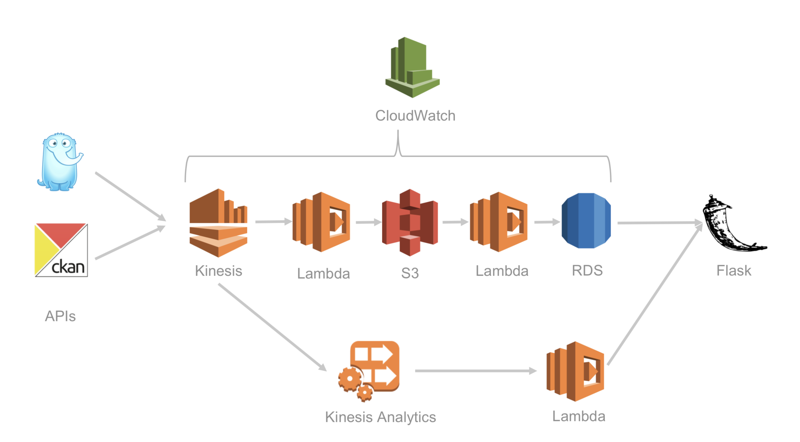

# Daily Review System
This is a daily review dashboard showing 311 complaints resolution performance for government agencies. With new complaint records being available via API, the data transform process is scheduled daily to extract the new data and produce a daily review dashboard describing the performance of each agency who is responsible for resolving the requested issues, compared with the historical records.

-------------------
| ->  [Demo]()        |                ->  [Slides]()           |
| ------------- |:-------------:|

-------------------

## Diagram

